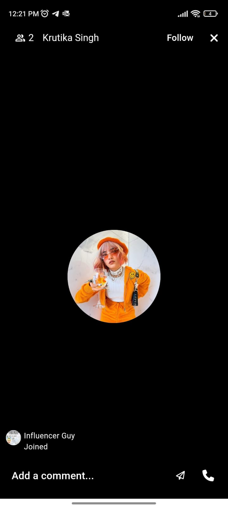

# Getting started

## User Onboarding

* This is the sign-up page for users and influencers to start off with Tawx
* Users can sign up using their phone number/E-mail ID, entering their Full Name and password
* They can also choose to authenticate using their Google Account

* Incase, they already have an account they can also Login into their account using their Phone Number/E-mail ID or Google Account

## Home Page

* Home page consists of a list of all the available influencers that and their profiles
* View profile button is ued view the influencer's profile
* Users can message with their favourite influencer by clicking on the Chat Button 
* Each influencers section contains the rate of calling and video calling them

## Chats Page

* The chats page contains the list of all the recent conversations of the user with the influencers

## Live Stream

* The live stream section contains influencers who are live streaming currently
* User can join in a live stream and interact with the influencer they like

## Profile Details Page

* The profile page contains the profile information of the user 
* The user can click on the edit icon to make changes to any of their personal information or change their profile picture

