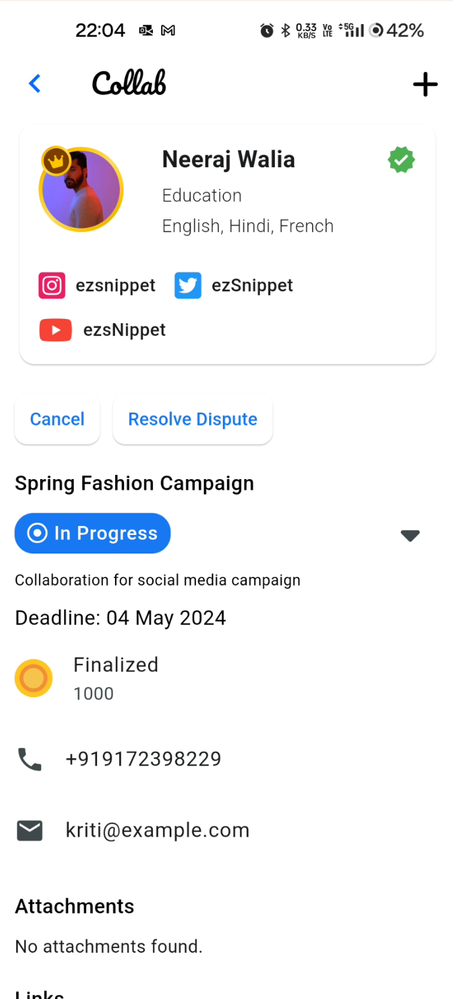

# Partner Onboarding

## Login as a User

* To register as an Influencer, first login as a normal user.
* Navigate to home page and click on the 3 dot menu near the coin icon at the top.

* Click on `Settings`
* Then, click on `Account` .

* Click on `Register as an Partner.`

## Phone number verification 

* click on `Update Now`

* Enter your phone number and tap `Continue`.

* An OTP will be sent to your number via SMS.
* Enter the for OTP as received for verification.

* Enter the otp and click `verify`.
* Exit to the previous screen and click `Register as a Partner` again.

## Entering relevant details.

* Here, users have the option to choose between becoming an `expert` or an `influencer`.
* Then, they have to choose the category they specialize in.
* After entering all the required details, click on `Submit`.

## Identity verification and supporting documents.

* Here, users can upload their identity documents to support their verification process.
* Our onboarding representatives will get in touch with to user to assist in this process.