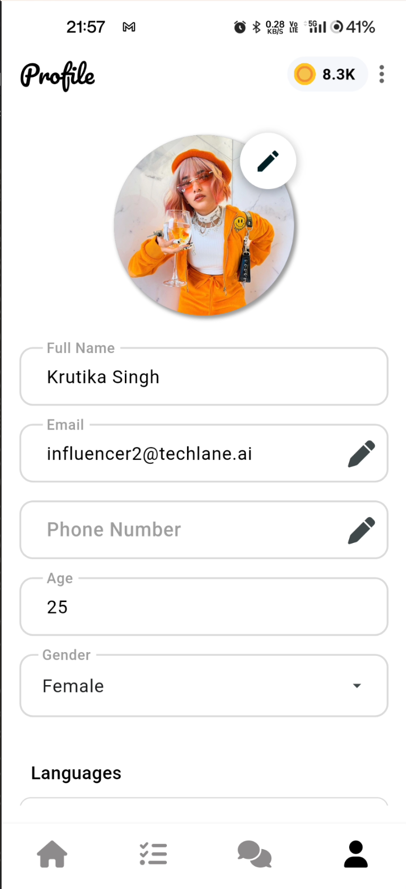

# Connecting with Influencers/Experts

## Influencer Profile

* Navigate to the home page and tap `view profile`.

* Click on `Follow` to get alerts and notifications for that influencer/expert.
* Click on `Message` to initiate a chat with that influencer/expert.

## Video call and Voice call requests 

* To initiate a voice/video call request click on the `call` icon near the top.

* This will initiate a popup near the bottom.

* Click on a desired option.
* Select duration.

* This will trigger a request to the influencer/partner.

* After the request is `approved`, click on the `call` icon again and initiate a video call.
* A Notification is displayed while the call on ongoing.

## Call charges

* Charges for call are based on duration. `xyz credits/ min`.

* After a call total charges for that session are displayed in the chat history.
* The same can be observed via payment history page.

## Rating Influencers/Partners

* Users can rate influencers by tapping the icon next to `call` on top of chats page.

## Notifications and alerts

* Chat notification.

* Call request notification.

* Incoming call notification.

* Missed call notification.

* A history of notifications can be viewed on the notification page.
* To access, tap the bell icon on the home page.

## Report Influencer/Expert

* This feature is used to report any inappropriate content or activity of the Tawx platform

* Clicking on the `report` symbol at the top right of the screen will open up the form to report the influencer/expert

* The option is also available on the chat page of the influencer/expert

