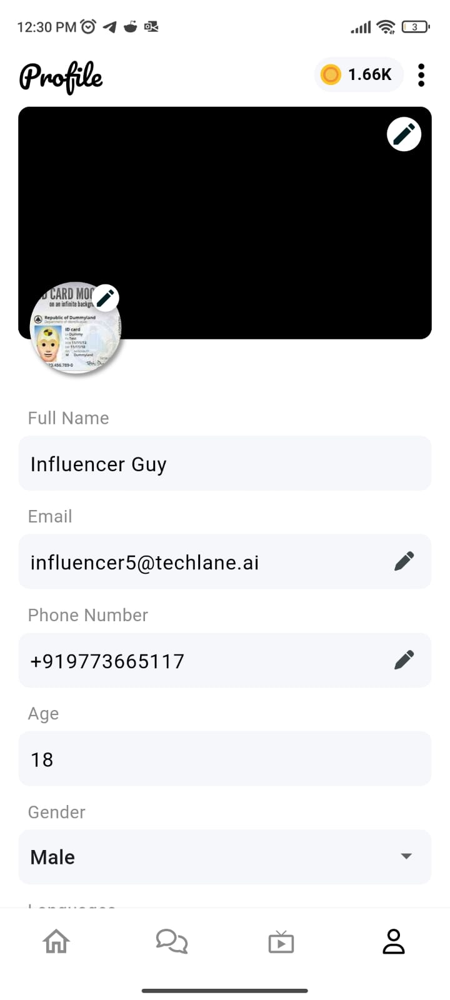
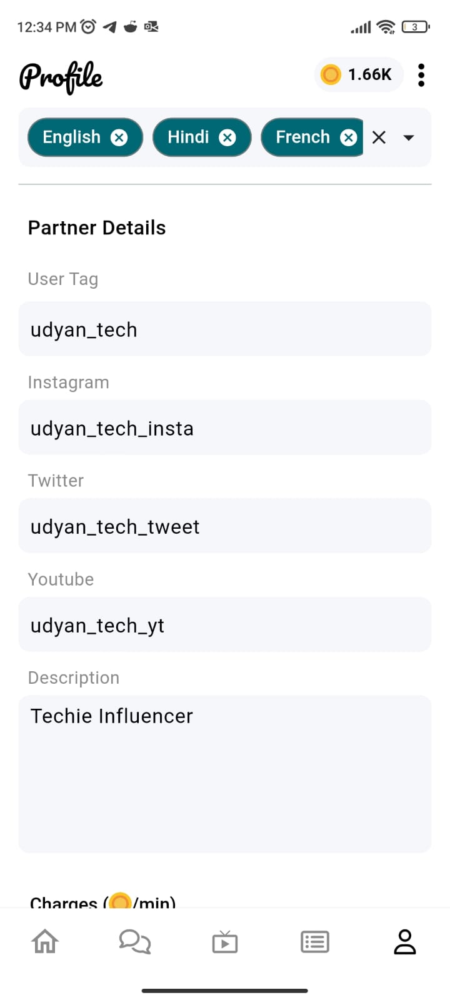
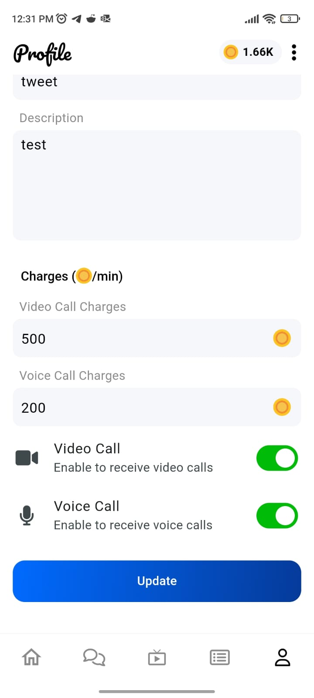

# Partner Docs

## Profile

* The profile page contains the profile information of the user information
* The user can click on the edit icon to make changes to any of their personal information or change their profile picture
* The user tag sections contains the social accounts that the influencer has connected with their profile
* The charges sections contains the rate which the influcencer has set for connecting with them via voice/video call

## Featured Videos

* Influencers/Partners can edit featured videos from their profile page by clicking on the edit icon on the top right

* They can add by clicking on the plus icon at the botton right and remove the featured videos on their profile

## Influencer Collabs

* Click on `Chat` to initiate a conversation with the influencer/partner.

* Clicking on `Collabs` can intiate a collab request with another influencer/partner

## Live Stream

* Click on `Live Stream` section allows an influencer to go live and interact with their fans

* After providing necessary camera and mic permissions, influencer has to click on `Go live`

## Requests

* The request sections contains a list of users who have requested an interaction with the influencer
* Call requests contains a list of call requests an influencer has received
* Collab requests contains a list of collaboration requests an influencer has received from other influencers

## Earnings

* Influencers can view their earnings and related stats.
* They can adjust the days as update bank details as well.